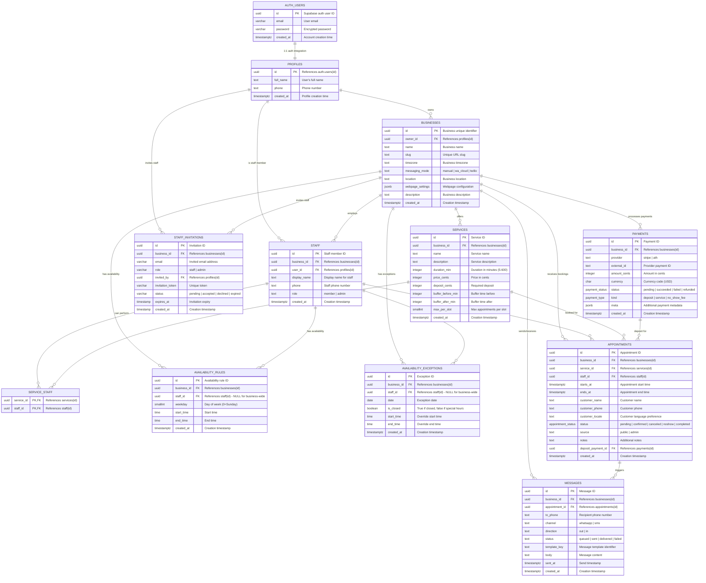

# BookIt Database Schema Diagram

## Entity Relationship Diagram



## Custom Types & Enums

```sql
-- Enum Types
CREATE TYPE appointment_status AS ENUM (
    'pending', 'confirmed', 'canceled', 'noshow', 'completed'
);

CREATE TYPE payment_status AS ENUM (
    'pending', 'succeeded', 'failed', 'refunded'
);

CREATE TYPE payment_type AS ENUM (
    'deposit', 'service', 'no_show_fee'
);
```

## Key Constraints & Features

### Primary Keys
- All tables use UUID primary keys with `gen_random_uuid()`
- `profiles.id` references Supabase `auth.users(id)`

### Foreign Key Relationships
- **CASCADE DELETE**: When business is deleted, all related data is removed
- **SET NULL**: When staff is deleted, appointments remain but staff_id becomes null
- **RESTRICT**: Services cannot be deleted if they have appointments

### Unique Constraints
- `businesses.slug` - Unique URL slugs for each business
- `service_staff` - Composite primary key prevents duplicate staff-service assignments
- `staff_invitations` - Unique business_id + email combination

### Special Features
- **Row Level Security (RLS)**: All tables have policies based on business membership
- **GIST Exclusion Constraint**: Prevents overlapping appointments for same staff
- **Time Range Validation**: Service duration must be 5-600 minutes
- **Timezone Support**: All timestamps use `timestamptz`

### Indexes for Performance
- Business ownership and membership lookups
- Appointment time-based queries
- Staff and service associations
- Payment and message tracking

## Data Flow Summary

1. **User Registration**: Creates profile linked to Supabase auth
2. **Business Setup**: Owner creates business, defines services and availability
3. **Staff Management**: Invite staff via email, assign to services
4. **Public Booking**: Customers book appointments through public interface
5. **Payment Processing**: Handle deposits via Stripe or ATH Móvil
6. **Communication**: Send WhatsApp/SMS notifications for appointments
7. **Schedule Management**: Track availability, exceptions, and appointment status